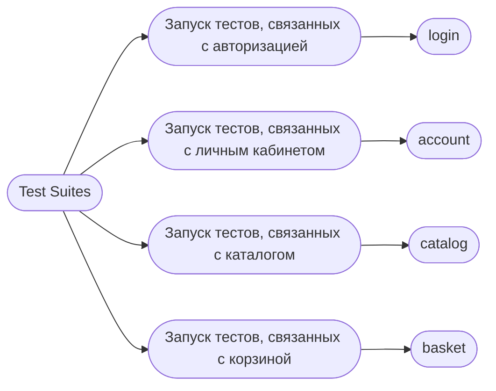
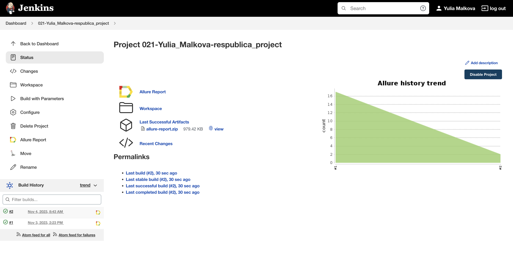
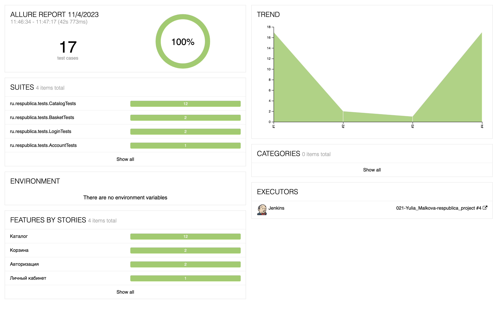
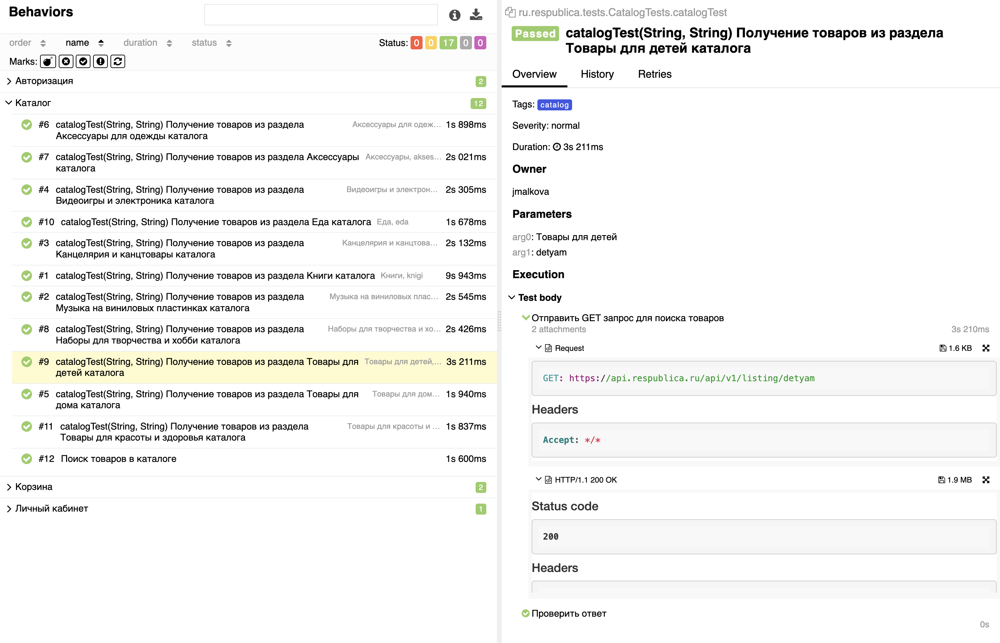
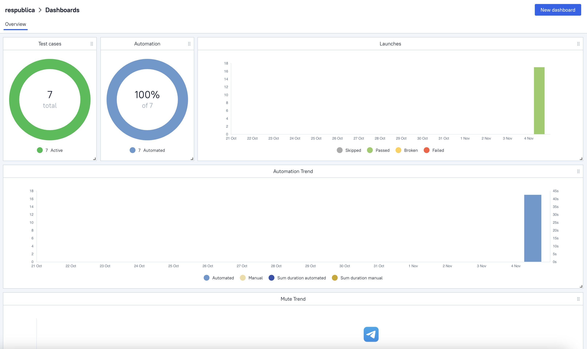
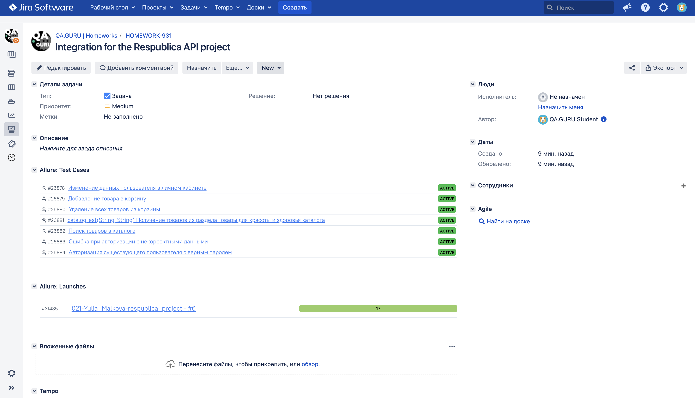
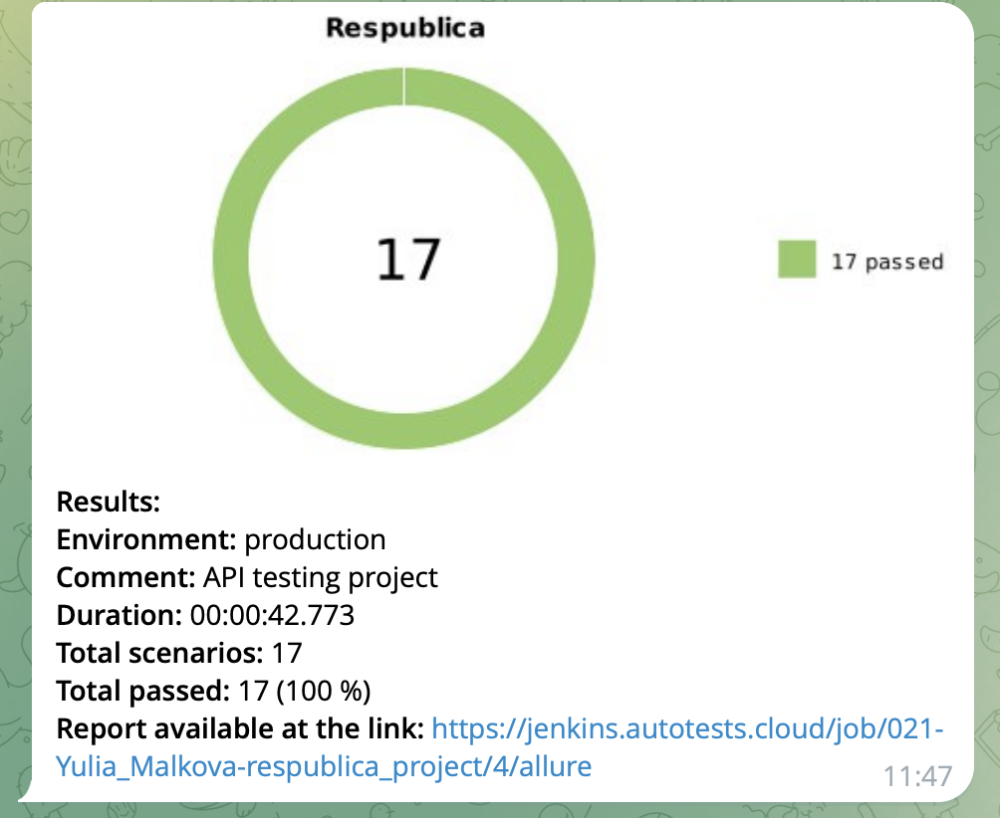

<p align="center">
<a href="https://www.respublica.ru/">  </a></h1>
<p align="center">

# <p align="center"> Проект по автоматизации тестовых API сценариев для  магазина "Республика" <p align="center">

##  Использованный стек технологий
<p align="center">


 


</p>

- В данном проекте автотесты написаны на языке <code>Java</code> с использованием фреймворков <code>Rest Assured</code> и <code>JUnit 5</code>.
- В качестве сборщика был использован - <code>Gradle</code>.
- Для удаленного запуска реализована джоба в Jenkins с формированием Allure-отчета и отправкой результатов в <code>Telegram</code> при помощи бота.
- Осуществлена интеграция с <code>Allure TestOps </code> и <code>Jira</code>.
  
##  Реализованные проверки
- Авторизация пользователя с валидными и невалидными данными
- Изменение данных в личном кабинете пользователя
- Получение товаров по разделам каталога
- Поиск товаров
- Добавление товара в корзину
- Удаление товара из корзины

##  Запуск автотестов

### Запуск тестов из терминала

Команда для запуска всех тестов из терминала:
```
gradle clean test
```

Для запуска можно выбрать один из четырех тест-сьютов:
```
gradle clean
${TEST_JOB}
```



##  Сборка в [Jenkins](https://jenkins.autotests.cloud/job/021-Yulia_Malkova-respublica_project/)
<p align="center">

</p>

##  Пример [Allure-отчета](https://jenkins.autotests.cloud/job/021-Yulia_Malkova-respublica_project/allure/)
### Overview

<p align="center">

</p>

### Результат выполнения теста

<p align="center">

</p>

##  Интеграция с [Allure TestOps](https://allure.autotests.cloud/project/3752/dashboards)

Выполнена интеграция сборки <code>Jenkins</code> с <code>Allure TestOps</code>.
Результат выполнения автотестов отображается в <code>Allure TestOps</code>
На Dashboard в <code>Allure TestOps</code> отображена статистика пройденных тестов.

<p align="center">

</p>

##  Интеграция с [Jira](https://jira.autotests.cloud/browse/HOMEWORK-931)

Реализована интеграция <code>Allure TestOps</code> с <code>Jira</code>, в тикете отображается информация, какие тест-кейсы были написаны в рамках задачи и результат их прогона.

<p align="center">

</p>

##  Уведомления в Telegram с использованием бота

После завершения сборки, бот созданный в <code>Telegram</code>, автоматически обрабатывает и отправляет сообщение с результатом.

<p align="center">

</p>

